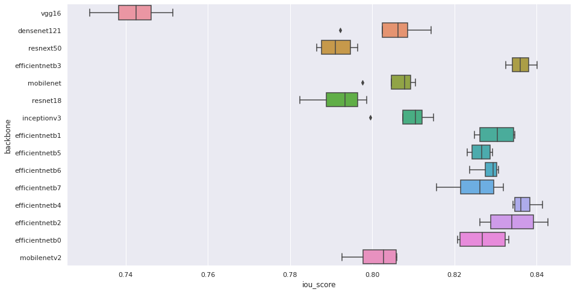
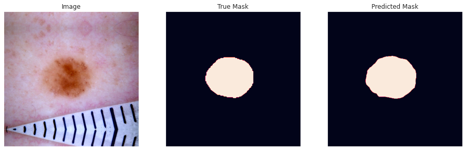
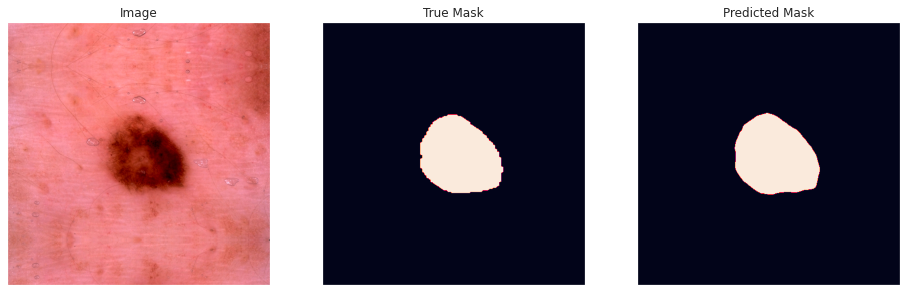
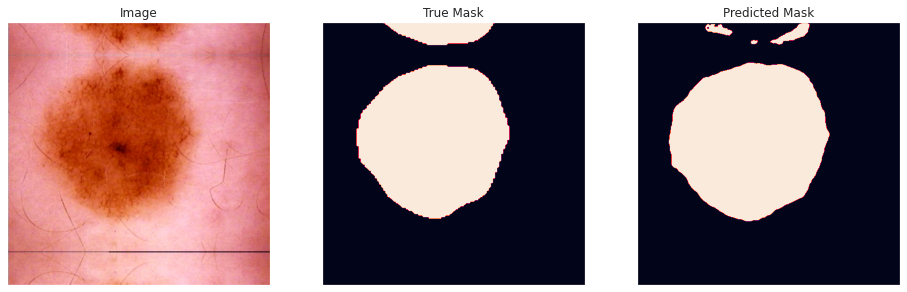
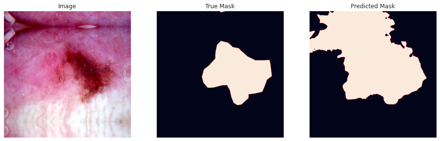
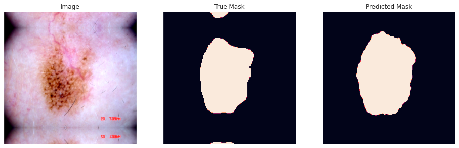
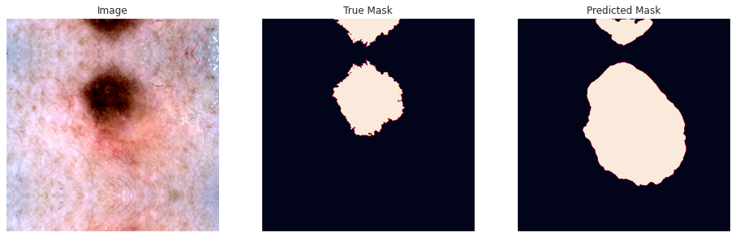
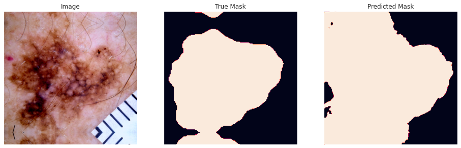
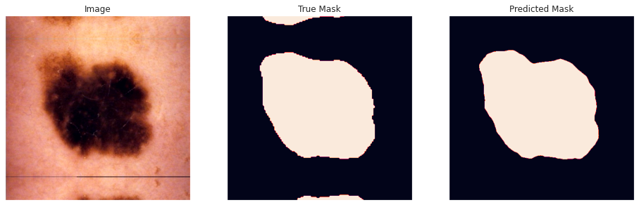
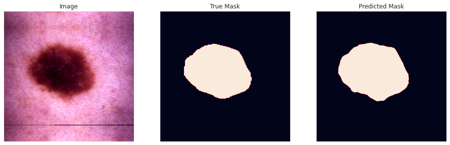

# ISIC2018

This repository makes use of the excellent [segmentation models](https://github.com/qubvel/segmentation_models) library (based on Keras) to segment skin lesions.
This library exposes 4 primary segmentation models, many pretrained backbone architectures (I count 34!), and a huge number of recommneded loss functions.

Overall, the flexibility of this library opens the door for tons of hyperparameter experiments to find the best architecutes.

### Overall process

1. Performed basic exploration of the dataset in [this notebook](EDA.ipynb)
2. Implemented training loop in pycharm
3. Executed training script in parallel on server with a variety of hyperparameter sweeps
    - [x] pretrained backbone architectures
    - Model types
      - [x] Unet
      - [ ] PSP
      - [ ] FPN
      - [ ] LinkNet
    - Loss functions
      - [x] Dice
      - [ ] .... many available
    - [ ] Learning rate optimization
    - [ ] Image size experiments (once server is finished)
4. Results analysis in [this notebook](ExpResults.ipynb)
   - Hyperparameter results
   - Visualized segmentation results on validation set for best models

### Results

##### Best models
IoU (Intersection over Union) of validation set images for various network backbones.

| backbone       | model   |   f1-score |   iou_score | lossfunc   | loss               |   val_loss |   val_iou_score |
|:---------------|:--------|-----------:|------------:|:-----------|:-------------------|-----------:|----------------:|
| efficientnetb2 | Unet    |   0.911623 |    0.842784 | dice       | 0.0888625383377075 |   0.131296 |        0.785293 |
| efficientnetb1 | Unet    |   0.905611 |    0.834358 | nan        | dice               |   0.135033 |        0.779533 |
| efficientnetb4 | Unet    |   0.907666 |    0.837252 | nan        | dice               |   0.141652 |        0.768666 |
| efficientnetb0 | Unet    |   0.905225 |    0.833252 | dice       | 0.0951778292655944 |   0.146715 |        0.760904 |
| densenet121    | Unet    |   0.893326 |    0.814384 | dice       | 0.1071189939975738 |   0.149303 |        0.755145 |
| efficientnetb5 | Unet    |   0.899602 |    0.828446 | dice       | 0.1005594655871391 |   0.151404 |        0.751347 |
| efficientnetb7 | Unet    |   0.901872 |    0.831914 | dice       | 0.0983607098460197 |   0.151908 |        0.752823 |
| efficientnetb6 | Unet    |   0.901224 |    0.830108 | dice       | 0.0989042446017265 |   0.15686  |        0.744913 |
| efficientnetb3 | Unet    |   0.909207 |    0.840058 | nan        | dice               |   0.160694 |        0.748528 |
| resnext50      | Unet    |   0.880391 |    0.796514 | dice       | 0.119969330728054  |   0.16466  |        0.735834 |
| inceptionv3    | Unet    |   0.893149 |    0.81492  | nan        | dice               |   0.166001 |        0.739982 |
| resnet18       | Unet    |   0.882507 |    0.798707 | dice       | 0.1177657768130302 |   0.183193 |        0.717013 |
| mobilenetv2    | Unet    |   0.888101 |    0.805828 | dice       | 0.1123277395963668 |   0.2006   |        0.696462 |
| vgg16          | Unet    |   0.850007 |    0.751489 | nan        | dice               |   0.204128 |        0.700157 |
| mobilenet      | Unet    |   0.890715 |    0.810495 | dice       | 0.1097130700945854 |   0.243964 |        0.644045 |

##### Segmentations on validation data
Segmentations performed on a handful of validation images for the best-performing efficientnet model.

Lessons learned : I think one of the mistakes I made was using a mirrored padding approach in the augmentations pipeline. You can see that the borders of some images are flipped. Note the rulers in the 1st and 3rd image. In some cases, as in image 4, the flipping can produce regions that look like lesions! (heh, that rhymed). Training/inference with different padding settings might alleviate this. 

### Next steps
- [ ] Implement self-supervised contrastive loss on derm images to pre-train backbones and perform domain transfer learning.
    - Question : does this pretraining improve performance?
